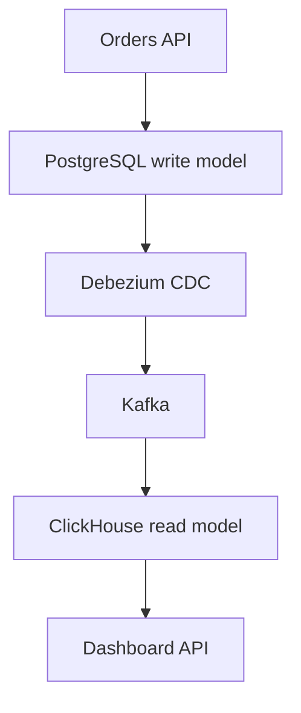
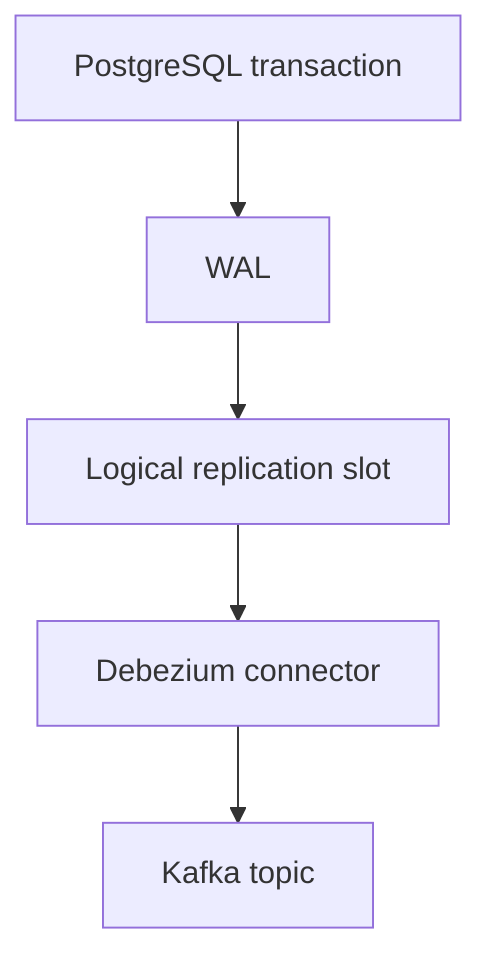
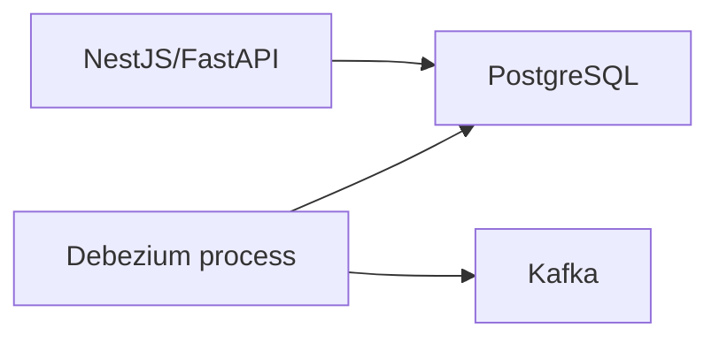
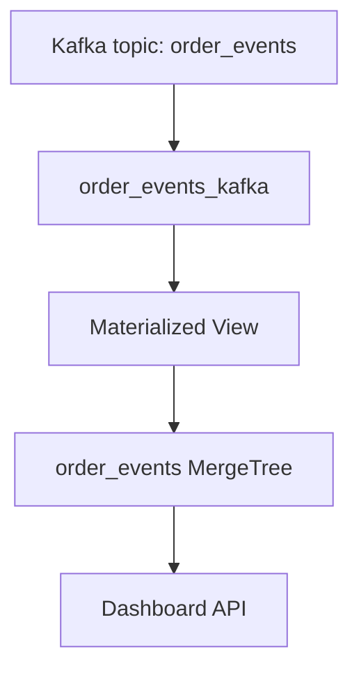
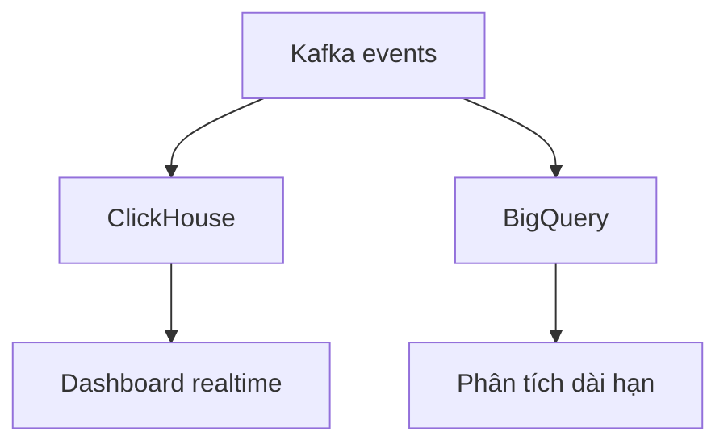

+++
date = '2026-08-03'
draft = false
title = 'System Design 2/30: CQRS, CDC và ClickHouse cho dashboard realtime'
summary = "Từ một PostgreSQL monolith quá tải đến read model realtime: CQRS, read replica, ACID, Outbox, Debezium, Kafka, ClickHouse và cách chọn BigQuery, Snowflake, Cassandra."
tags = ['System Design', 'CQRS', 'CDC', 'PostgreSQL', 'Kafka', 'Debezium', 'ClickHouse']
+++

# System Design 2/30: CQRS, CDC và ClickHouse cho dashboard realtime



Giả sử `orders-service` của chúng ta là một PostgreSQL monolith đang xử lý khoảng **8.000 lượt ghi/phút** và **40.000 lượt đọc/phút**.

Phía ghi cần dữ liệu được chuẩn hoá:

- `orders`
- `line_items`
- `payments`
- `shipments`
- `addresses`

Cấu trúc này có foreign key rõ ràng, hạn chế dữ liệu lặp và thuận lợi cho transaction. Nhưng phía đọc lại muốn điều ngược lại: dashboard phải join bảy bảng chỉ để dựng một order card, còn báo cáo chạy lúc 9 giờ sáng đẩy CPU database lên 85%.

Index đã được tối ưu. Cache cũng đã được thêm. Vấn đề không còn đơn thuần là thiếu phần cứng. **Write model và read model đang muốn hai hình dạng dữ liệu khác nhau, nhưng chúng ta vẫn buộc chúng dùng chung một schema.**

Bốn lựa chọn được đưa ra:

- **A. Full CQRS:** tách read model và write model, project thay đổi sang một read store đã denormalize; chấp nhận eventual consistency.
- **B. Read replica:** dashboard và báo cáo đọc replica, command vẫn ghi primary.
- **C. Denormalize write schema:** nhét `line_items` vào `orders`, nhân bản customer data để giảm join.
- **D. GraphQL + DataLoader:** batch và deduplicate các lần load ở application layer, giữ nguyên database.

Trong tình huống này, lựa chọn giải quyết đúng vấn đề nhất là **A: CQRS**. Nhưng để hiểu vì sao, chúng ta cần tách từng lớp vấn đề thay vì chỉ nhớ tên pattern.

## ACID là gì và tại sao write side cần nó?

ACID là bốn thuộc tính quan trọng của transaction trong database:

| Chữ | Tên | Hiểu đơn giản |
|---|---|---|
| A | Atomicity | Một transaction hoặc thành công toàn bộ, hoặc rollback toàn bộ |
| C | Consistency | Transaction không được phá vỡ các constraint và quy tắc dữ liệu |
| I | Isolation | Các transaction đồng thời không được nhìn thấy trạng thái dở dang của nhau |
| D | Durability | Khi đã commit thành công, dữ liệu không bị mất dù hệ thống crash |

Ví dụ khi tạo một đơn hàng, hệ thống cần:

1. Tạo `orders`.
2. Tạo các `line_items`.
3. Ghi nhận payment.
4. Trừ tồn kho hoặc giữ chỗ tồn kho.

Nếu bước 3 thất bại thì ta không muốn database giữ lại một nửa đơn hàng. Atomicity cho phép rollback cả transaction. Foreign key và constraint giúp duy trì consistency. Isolation ngăn hai transaction nhìn thấy dữ liệu chưa commit. Durability đảm bảo order đã báo thành công không biến mất sau khi PostgreSQL restart.

Đó là lý do write side thường thích schema chuẩn hoá và transaction rõ ràng. Denormalize write schema chỉ để dashboard đọc nhanh có thể làm quy tắc nghiệp vụ trở nên khó giữ hơn.

## Mổ xẻ bốn lựa chọn

### A. CQRS: giải quyết đúng sự khác biệt về hình dạng dữ liệu

CQRS là viết tắt của **Command Query Responsibility Segregation**: tách trách nhiệm thay đổi dữ liệu và đọc dữ liệu.

- Command đi vào write model được tối ưu cho nghiệp vụ, transaction và tính đúng đắn.
- Query đi vào read model được tối ưu cho đúng màn hình hoặc báo cáo cần phục vụ.

Read và write có thể vẫn dùng cùng một loại database, nhưng không bắt buộc cùng schema, cùng bảng hay thậm chí cùng công nghệ.

Ví dụ:

```text
Write model:
orders + line_items + payments + shipments + addresses

Read model:
order_card
  order_id
  customer_name
  item_names
  total_amount
  payment_status
  shipment_status
  delivery_address
```

Thay vì join bảy bảng cho mỗi request, dashboard đọc một document hoặc một hàng đã chuẩn bị sẵn.

CQRS **không đồng nghĩa với Event Sourcing**. Ta có thể tiếp tục dùng PostgreSQL theo cách truyền thống làm source of truth, sau đó phát các thay đổi sang read model. Event Sourcing là một lựa chọn khác, trong đó event log trở thành source of truth; nó không phải điều kiện bắt buộc để triển khai CQRS.

### B. Read replica: giảm tranh chấp tài nguyên nhưng không đổi read model

Read replica đúng là mô hình gần giống primary/replica trước đây thường gọi là master/slave:

- Primary nhận `INSERT`, `UPDATE`, `DELETE`.
- Replica nhận WAL từ primary và replay thay đổi.
- Dashboard và reporting query replica.

B có thể rất hữu ích. Nó tách CPU và I/O của workload đọc khỏi primary, giúp write side bớt nghẹt. Đây thường là bước cứu hoả hợp lý.

Nhưng replica vẫn có:

- Cùng schema.
- Cùng cách tổ chức dữ liệu.
- Vẫn phải join bảy bảng.
- Vẫn chạy những aggregation nặng.

Nói cách khác, read replica giải quyết câu hỏi **“query chạy ở máy nào?”**, còn CQRS giải quyết câu hỏi **“dữ liệu nên có hình dạng nào để query?”**.

Nếu nguyên nhân chỉ là primary bị tranh CPU giữa read và write, B có thể đủ. Nếu nguyên nhân là read và write thật sự cần hai mô hình trái ngược nhau, B chỉ mua thêm thời gian.

Replica cũng có replication lag. Viết xong ở primary không có nghĩa replica đã replay xong ngay lập tức.

### C. Denormalize write schema: cái bẫy dễ thấy kết quả trong sáu tháng đầu

Flatten dữ liệu ngay trong write schema có thể làm dashboard nhanh lên rất nhanh. Nhưng cái giá là:

- Customer đổi tên hoặc địa chỉ thì phải cập nhật nhiều bản sao.
- Dữ liệu lịch sử và dữ liệu hiện tại dễ bị trộn nghĩa.
- Constraint trở nên khó biểu diễn.
- Transaction phải cập nhật nhiều nơi.
- Có nguy cơ các bản sao không đồng nhất.
- Schema phục vụ query hôm nay có thể gây khó cho nghiệp vụ ngày mai.

Denormalization không xấu. Vấn đề là **denormalize source of truth chỉ để phục vụ một read pattern**. Denormalization phù hợp hơn ở read model, nơi dữ liệu có thể được xoá và rebuild từ source of truth khi cần.

### D. GraphQL + DataLoader: giải quyết N+1, không giải quyết analytical workload

DataLoader thường gom những request như:

```text
load customer 1
load customer 1
load customer 2
load customer 2
```

thành:

```sql
SELECT * FROM customers WHERE id IN (1, 2);
```

Nó có hai lợi ích chính trong phạm vi một request:

- Batch nhiều lookup thành ít query hơn.
- Cache/deduplicate những key bị load lặp lại.

Điều này không có nghĩa DataLoader “load nhiều dữ liệu trùng rồi mới gộp”. Thông thường nó thu thập key trước, loại key trùng và gửi một batch query. Nó giúp N+1 ở resolver layer, nhưng không làm cho một phép join bảy bảng hay một báo cáo quét hàng trăm triệu dòng biến mất.

GraphQL cũng chỉ thay đổi cách client yêu cầu dữ liệu. Nó không tự tạo read model tối ưu bên dưới.

## A và B không loại trừ nhau

Trong production, kiến trúc hợp lý có thể là:

1. Thêm read replica để giảm áp lực ngay lập tức.
2. Đưa báo cáo nặng ra khỏi OLTP database.
3. Xây read model cho các query có giá trị cao nhất.
4. Chuyển dần dashboard sang read store.

B có thể là biện pháp giảm đau trong lúc A được triển khai. Không nhất thiết phải “big bang” biến toàn bộ hệ thống thành CQRS trong một lần release.

## Một CQRS thực tế trông như thế nào?



Vai trò của từng thành phần:

| Thành phần | Vai trò |
|---|---|
| PostgreSQL | Source of truth, giữ write model chuẩn hoá và transaction ACID |
| Outbox table | Ghi business event trong cùng transaction với dữ liệu nghiệp vụ |
| Debezium | Đọc thay đổi từ PostgreSQL WAL bằng CDC |
| Kafka | Lưu và phân phối event stream, cho phép nhiều consumer đọc độc lập |
| Projection | Biến event thành hình dạng dữ liệu phục vụ query |
| ClickHouse | Lưu read model và phục vụ analytical query độ trễ thấp |
| Dashboard API | Query ClickHouse rồi trả JSON cho web/mobile |

Read store có thể là PostgreSQL khác, Elasticsearch, Redis, Cassandra, ClickHouse hoặc một công cụ khác. Lựa chọn phụ thuộc vào query pattern, không phụ thuộc vào việc tên kiến trúc là CQRS.

## Projection là gì?

Projection là logic biến chuỗi thay đổi của write side thành trạng thái ở read side.

Ví dụ event:

```json
{
  "event_id": "evt-123",
  "event_type": "OrderPaid",
  "order_id": "ord-456",
  "shop_id": 12,
  "amount": 890000,
  "occurred_at": "2026-08-03T10:15:00Z"
}
```

Projection có thể:

- Cập nhật `payment_status = 'paid'` trong bảng `order_card`.
- Cộng `890000` vào doanh thu của shop theo phút.
- Tăng bộ đếm `paid_orders`.
- Index document vào Elasticsearch để tìm kiếm.

Projection có thể được viết bằng code trong Kafka consumer, Kafka Streams, Flink, ksqlDB, hoặc dùng materialized view của ClickHouse cho phép biến đổi phù hợp. Không có yêu cầu phải dùng một framework đặc biệt.

Điểm quan trọng là projection phải:

- **Idempotent:** xử lý lại cùng event không làm cộng doanh thu hai lần.
- **Có thể retry:** lỗi tạm thời không làm mất event.
- **Theo dõi được tiến độ:** biết consumer đang chậm bao nhiêu.
- **Có khả năng rebuild:** có thể xoá read model và replay event khi schema projection thay đổi.

## Vì sao cần Transactional Outbox?

Một implementation ngây thơ thường làm:

```text
1. INSERT order vào PostgreSQL
2. COMMIT
3. publish OrderCreated lên Kafka
```

Nếu service crash sau bước 2 nhưng trước bước 3, order đã tồn tại nhưng event bị mất.

Nếu publish Kafka trước rồi transaction PostgreSQL rollback, consumer lại nhận event cho một order không tồn tại.

Đây là bài toán dual write: một request phải ghi thành công vào hai hệ thống không cùng transaction.

Outbox giải quyết bằng cách ghi business data và event vào **cùng một PostgreSQL transaction**:

```sql
BEGIN;

INSERT INTO orders(id, customer_id, status, total_amount)
VALUES ('ord-456', 'cus-10', 'created', 890000);

INSERT INTO outbox_events(
    id,
    aggregate_type,
    aggregate_id,
    event_type,
    payload,
    created_at
)
VALUES (
    'evt-123',
    'order',
    'ord-456',
    'OrderCreated',
    '{"order_id":"ord-456","customer_id":"cus-10","total_amount":890000}',
    now()
);

COMMIT;
```

Khi commit:

- Cả order và outbox event cùng tồn tại.
- Hoặc cả hai cùng rollback.

Sau đó một publisher chuyển row trong outbox sang Kafka.

## CDC là gì?

CDC là **Change Data Capture**: bắt những thay đổi đã xảy ra trong database và chuyển chúng thành change event cho hệ thống khác sử dụng.

Có ba cách thường gặp:

| Cách | Cơ chế | Điểm cần lưu ý |
|---|---|---|
| Polling table | Chạy `SELECT` định kỳ trên outbox | Dễ làm nhưng phải quản lý polling, lock, trạng thái đã gửi |
| Application hook/observer | Code ứng dụng tự publish khi model thay đổi | Dễ bỏ sót thay đổi ngoài app; có dual-write risk |
| Log-based CDC | Đọc transaction log của database | Ít xâm lấn write path, giữ thứ tự commit tốt hơn nhưng vận hành phức tạp hơn |

Debezium thuộc nhóm log-based CDC.

## Debezium thật sự “watch” cái gì?

Với PostgreSQL, Debezium **không liên tục chạy `SELECT` để watch table**.

PostgreSQL ghi mọi thay đổi cần thiết cho recovery vào **WAL — Write-Ahead Log**. Với `wal_level = logical`, PostgreSQL có thể logical-decode WAL thành các thay đổi ở mức row. Debezium tạo hoặc sử dụng một logical replication slot, kết nối bằng replication protocol và đọc stream thay đổi đó.



Ta có thể cấu hình Debezium chỉ lấy thay đổi của `outbox_events`, nhưng cơ chế bên dưới vẫn là đọc WAL rồi filter theo table/publication. Nói “Debezium watch table” là cách diễn đạt dễ hiểu ở mức nghiệp vụ; nói chính xác về kỹ thuật là “Debezium đọc change stream từ WAL qua logical decoding và replication slot”.

Replication slot giữ lại WAL mà consumer chưa xác nhận. Điều này giúp Debezium tạm dừng rồi đọc tiếp mà không mất change. Mặt trái là nếu connector chết quá lâu, PostgreSQL phải giữ ngày càng nhiều WAL và có thể đầy disk. `pg_replication_slots`, retained WAL và connector health là những chỉ số bắt buộc phải monitor.

## NestJS hay FastAPI kết nối vào WAL ở đâu?

Câu trả lời ngắn: **không có chỗ nào trong NestJS hoặc FastAPI phải kết nối WAL**.

Application chỉ ghi transaction bình thường:



NestJS/FastAPI dùng connection thông thường để chạy SQL. Debezium là một process độc lập, thường chạy qua Kafka Connect, Docker hoặc Kubernetes. Chính Debezium mới mở replication connection tới PostgreSQL.

Ví dụ pseudo-code NestJS:

```ts
await dataSource.transaction(async (manager) => {
  await manager.insert(Order, order);

  await manager.insert(OutboxEvent, {
    id: eventId,
    aggregateType: 'order',
    aggregateId: order.id,
    eventType: 'OrderCreated',
    payload: JSON.stringify({
      orderId: order.id,
      totalAmount: order.totalAmount,
    }),
  });
});
```

Ví dụ pseudo-code FastAPI/SQLAlchemy:

```python
with Session(engine) as session:
    with session.begin():
        session.add(order)
        session.add(
            OutboxEvent(
                id=event_id,
                aggregate_type="order",
                aggregate_id=order.id,
                event_type="OrderCreated",
                payload={
                    "order_id": order.id,
                    "total_amount": order.total_amount,
                },
            )
        )
```

Ứng dụng không cần gọi Kafka trong transaction này. Debezium đọc row outbox sau khi transaction commit và publish nó.

## Setup Debezium ở mức tối thiểu

### 1. Bật logical decoding trong PostgreSQL

Các thiết lập cốt lõi gồm:

```conf
wal_level = logical
max_wal_senders = 10
max_replication_slots = 10
```

Cần tạo user có quyền replication và cấp quyền đọc table/publication phù hợp. Cấu hình thật còn phụ thuộc PostgreSQL managed service, network và chính sách bảo mật.

### 2. Chạy Kafka và Kafka Connect có Debezium plugin

Debezium PostgreSQL Connector thường được chạy như một Kafka Connect connector. Kafka Connect quản lý lifecycle, offset, task và restart cho connector.

### 3. Đăng ký connector

Ví dụ rút gọn:

```json
{
  "name": "orders-outbox-connector",
  "config": {
    "connector.class": "io.debezium.connector.postgresql.PostgresConnector",
    "database.hostname": "postgres",
    "database.port": "5432",
    "database.user": "debezium",
    "database.password": "change-me",
    "database.dbname": "orders",
    "topic.prefix": "orders-db",
    "plugin.name": "pgoutput",
    "slot.name": "orders_outbox_slot",
    "publication.autocreate.mode": "filtered",
    "table.include.list": "public.outbox_events",
    "transforms": "outbox",
    "transforms.outbox.type": "io.debezium.transforms.outbox.EventRouter"
  }
}
```

Đây là config minh hoạ, không nên copy nguyên vào production. Secret cần nằm trong secret manager; replication slot phải có naming và monitoring rõ ràng; schema của outbox cần khớp cấu hình Outbox Event Router.

### 4. Quan sát event trong Kafka

Luồng hoàn chỉnh:

```text
PostgreSQL commit
→ WAL xuất hiện change
→ replication slot cung cấp change stream
→ Debezium decode và chuyển đổi outbox row
→ Kafka nhận business event
```

## Framework observer có thay Debezium được không?

Nhiều framework có ORM hook, domain event hoặc observer như:

- TypeORM subscriber.
- Sequelize hook.
- Django signal.
- SQLAlchemy event.
- Spring application event.

Chúng hữu ích cho logic bên trong process, nhưng không tương đương log-based CDC.

Nếu observer publish Kafka sau commit và process crash đúng thời điểm đó, event vẫn có thể mất. Nếu một script SQL, migration hoặc service khác cập nhật database mà không đi qua observer, event cũng không được phát. Observer còn bị ràng buộc với lifecycle của application instance.

Observer không xấu; nó chỉ giải quyết bài toán khác. Có thể dùng observer để tạo domain event, nhưng vẫn nên persist event vào outbox trong cùng transaction nếu event phải được gửi đáng tin cậy ra bên ngoài.

## Nếu write xong mà read model chưa cập nhật thì sao?

Đây là eventual consistency. CQRS không xoá bỏ khoảng trễ; nó biến khoảng trễ thành một phần rõ ràng của thiết kế.

Giả sử:

```text
10:00:00.000  PostgreSQL commit order
10:00:00.020  Debezium nhận change
10:00:00.040  Kafka nhận event
10:00:00.090  Projection cập nhật ClickHouse
```

Trong khoảng 90 ms đó, query read model có thể chưa thấy order mới. Khi Kafka bị backlog hoặc projection lỗi, khoảng trễ có thể dài hơn nhiều.

Các chiến lược thường dùng:

### 1. Trả dữ liệu vừa ghi ngay trong command response

Sau `POST /orders`, API trả về order vừa tạo. UI có thể hiển thị nó ngay mà không cần lập tức query read model.

### 2. Optimistic UI

UI thêm order vào danh sách với trạng thái `processing`, sau đó đồng bộ lại khi projection bắt kịp.

### 3. Read-your-write từ primary

Trong một khoảng thời gian ngắn sau khi ghi, request của chính user đó đọc primary/write store. Các request thông thường vẫn đọc read model.

Có thể trả một `version`, transaction LSN hoặc write token. Read API chỉ trả kết quả khi projection checkpoint đã đạt version đó, hoặc fallback sang write store.

### 4. Poll/retry có giới hạn

Client poll read API trong vài giây với exponential backoff. Đây là cách đơn giản cho các flow không yêu cầu phản hồi tức thời tuyệt đối.

### 5. Giữ critical read trên strong-consistency path

Không phải dữ liệu nào cũng nên đọc từ projection. Ví dụ ngay trước khi refund, hệ thống phải kiểm tra payment source of truth thay vì tin dashboard read model.

Điểm quan trọng là định nghĩa consistency theo use case:

- Dashboard chậm hai giây có thể chấp nhận được.
- Xác nhận thanh toán hoặc số dư tài khoản có thể không chấp nhận được.

## CQRS có làm projection hết timeout không?

Không.

CQRS giúp request ghi không phải chờ dashboard model được xây xong. Vì projection chạy bất đồng bộ, write API có thể trả lời nhanh hơn. Nhưng chi phí tính toán không biến mất; nó được chuyển sang consumer/projection pipeline.

Projection vẫn có thể chậm vì:

- Consumer không đủ instance.
- Kafka partition phân bố không đều.
- Một event đòi hỏi join hoặc lookup nặng.
- Read store insert quá chậm.
- Poison event retry vô hạn.
- Schema migration làm consumer lỗi.

Do đó phải theo dõi **projection lag**, không chỉ HTTP timeout.

Các chỉ số quan trọng:

- Tuổi của event mới nhất đã được project.
- Kafka consumer lag theo partition.
- Tốc độ event vào và event xử lý.
- Số lần retry và DLQ.
- Thời gian insert vào read store.
- WAL được replication slot giữ lại.
- Sai lệch giữa source of truth và read model qua reconciliation job.

Muốn giảm lag có thể tăng consumer, tăng partition, batch insert, precompute hợp lý, giảm lookup đồng bộ, xử lý poison event bằng DLQ và thiết kế idempotency. CQRS chỉ tạo ranh giới để ta scale các phần độc lập; nó không tự động làm chúng nhanh.

## Những bài toán thường dùng CQRS

CQRS đáng cân nhắc khi có ít nhất một trong các dấu hiệu sau:

- Tỷ lệ read/write rất lệch và hai phía cần scale khác nhau.
- Read query cần denormalize, full-text search hoặc aggregation khác xa write schema.
- Một thay đổi cần cung cấp nhiều view cho nhiều consumer.
- Dashboard, leaderboard hoặc observability cần cập nhật liên tục.
- Domain command phức tạp nhưng UI cần response đọc rất đơn giản.
- Hệ thống chấp nhận eventual consistency được định nghĩa rõ.

Ví dụ cụ thể:

| Bài toán | Write store | Read store phổ biến | Projection |
|---|---|---|---|
| E-commerce order | PostgreSQL/MySQL | PostgreSQL read DB, Elasticsearch, ClickHouse | Debezium + Kafka consumer |
| Search catalog | PostgreSQL | Elasticsearch/OpenSearch | CDC + indexer |
| Leaderboard game | Transaction DB | Redis Sorted Set, ClickHouse | Kafka Streams/consumer |
| Banking dashboard | Core ledger DB | Read DB/warehouse | Event bus + audited projector |
| IoT telemetry | Device ingestion store | ClickHouse/TimescaleDB | Kafka/Flink |
| Audit/observability | Application DB/log pipeline | ClickHouse | Kafka/Vector/OTel pipeline |

Không nên dùng CQRS chỉ vì “microservice hiện đại”. Với CRUD nhỏ, ít traffic và query đơn giản, một PostgreSQL schema tốt thường dễ vận hành và đáng tin cậy hơn rất nhiều.

## Những database thường xuất hiện ở read side

### PostgreSQL read database

Phù hợp khi read model vẫn là relational, traffic vừa phải, team muốn tái sử dụng kỹ năng SQL và vận hành PostgreSQL. Read DB trong CQRS khác replica ở chỗ schema có thể được denormalize hoàn toàn theo query.

### Elasticsearch/OpenSearch

Phù hợp cho full-text search, autocomplete, faceted filtering và relevance ranking. Không nên coi nó là source of truth cho transaction order.

### Redis

Phù hợp cho cache, counter, session, leaderboard và lookup cần độ trễ cực thấp. Dung lượng và durability cần được cân nhắc.

### Cassandra

Cassandra là distributed wide-column database, phù hợp khi cần ghi rất lớn, scale ngang đa node/đa vùng và query theo access pattern đã biết trước. Ta thiết kế table quanh query key; nó không dành cho join ad-hoc như data warehouse.

### ClickHouse

ClickHouse là column-oriented analytical database. Nó phù hợp cho event, log, metric, dashboard realtime và aggregation trên lượng dữ liệu rất lớn. Nó không thay PostgreSQL ở vai trò OLTP transaction database.

### BigQuery

BigQuery là serverless data warehouse của Google Cloud. Nó rất mạnh cho SQL ad-hoc quét TB/PB, báo cáo doanh nghiệp và data science mà không phải tự vận hành cluster. BigQuery không self-host được; muốn dùng sản phẩm BigQuery thì sử dụng dịch vụ của Google Cloud.

### Snowflake

Snowflake là cloud data platform chạy trên AWS, Azure hoặc Google Cloud. Nó tách compute warehouse khỏi storage, mạnh về chia sẻ dữ liệu, quản trị, workload isolation và hệ sinh thái enterprise analytics. Đây cũng là managed service, không phải database để tải binary về self-host như PostgreSQL hay ClickHouse OSS.

## Kafka vào ClickHouse ở bước nào?

Có nhiều cách đưa Kafka vào ClickHouse:

- ClickHouse Kafka Table Engine.
- Kafka Connect Sink Connector.
- ClickPipes trên ClickHouse Cloud.
- Consumer tự viết bằng NestJS, Java, Go hoặc Python.

Với Kafka Table Engine, luồng đơn giản là:



### Bảng đích thật sự

```sql
CREATE TABLE order_events
(
    event_id String,
    order_id String,
    shop_id UInt64,
    event_type LowCardinality(String),
    amount Decimal(18, 2),
    created_at DateTime64(3)
)
ENGINE = MergeTree
PARTITION BY toYYYYMM(created_at)
ORDER BY (shop_id, created_at, order_id);
```

`order_events` là bảng thật nằm trong ClickHouse. Dữ liệu được lưu theo MergeTree và được thiết kế để query theo `shop_id` và thời gian.

### Kafka Engine table

```sql
CREATE TABLE order_events_kafka
(
    event_id String,
    order_id String,
    shop_id UInt64,
    event_type String,
    amount Decimal(18, 2),
    created_at DateTime64(3)
)
ENGINE = Kafka
SETTINGS
    kafka_broker_list = 'kafka:9092',
    kafka_topic_list = 'order_events',
    kafka_group_name = 'clickhouse-order-events',
    kafka_format = 'JSONEachRow';
```

`order_events_kafka` chủ yếu mô tả:

- Kafka broker ở đâu.
- Đọc topic nào.
- Consumer group nào.
- Message có format gì.
- Các field ClickHouse dự kiến parse từ message.

Nó là cầu nối stream, không phải bảng lưu trữ lâu dài như MergeTree. Chạy `SELECT` trực tiếp trên Kafka Engine có thể consume message và làm offset tiến lên, nên trong flow thông thường dashboard không query bảng này.

### Materialized view nối stream vào bảng đích

```sql
CREATE MATERIALIZED VIEW order_events_mv
TO order_events
AS
SELECT
    event_id,
    order_id,
    shop_id,
    event_type,
    amount,
    created_at
FROM order_events_kafka;
```

Câu `SELECT` trong materialized view **không phải câu query mà developer phải chạy định kỳ**. Nó định nghĩa phép biến đổi. Khi Kafka Engine nhận block message mới, materialized view tự chạy phép `SELECT` đó trên block mới và insert kết quả vào `order_events`.

Nếu payload Kafka có field khác schema đích, phép `SELECT` có thể parse, cast, đổi tên hoặc tính thêm field trước khi insert.

## Dashboard realtime được hiển thị như thế nào?

“Realtime” trong kiến trúc này nghĩa là dữ liệu đi qua pipeline với độ trễ đủ thấp so với yêu cầu business, không có nghĩa bằng 0 ms.

```text
Order commit PostgreSQL
→ Debezium đọc WAL
→ Kafka nhận event
→ ClickHouse consume event
→ materialized view insert vào MergeTree
→ dashboard query thấy dữ liệu mới
```

Dashboard không cần dùng giao diện riêng của ClickHouse. Backend có thể kết nối qua HTTP interface hoặc native driver:

```sql
SELECT
    toStartOfMinute(created_at) AS minute,
    count() AS orders,
    sum(amount) AS revenue
FROM order_events
WHERE shop_id = 12
  AND created_at >= now() - INTERVAL 15 MINUTE
GROUP BY minute
ORDER BY minute;
```

NestJS/FastAPI chạy query này rồi trả JSON cho React/Vue/mobile app. Grafana, Superset hay Metabase chỉ là những client dựng biểu đồ có sẵn; chúng không bắt buộc.

Nếu frontend cần tự cập nhật liên tục, có thể:

- Poll API mỗi vài giây.
- Dùng Server-Sent Events.
- Dùng WebSocket.
- Backend push notification khi có metric mới.

ClickHouse giúp query nhanh; cơ chế browser refresh hay push là trách nhiệm của application layer.

## Tại sao ClickHouse query dashboard nhanh?

ClickHouse lưu dữ liệu theo cột. Nếu query chỉ cần `shop_id`, `created_at` và `amount`, engine không phải đọc toàn bộ các cột khác của event.

Với:

```sql
ORDER BY (shop_id, created_at, order_id)
```

dữ liệu cùng shop và gần nhau về thời gian được đặt gần nhau. Sparse primary index và data skipping giúp bỏ qua phần lớn block không liên quan.

Ta còn có thể tổng hợp trước theo phút:

```text
shop_id | minute | total_orders | revenue | failed_payments
12      | 10:01  | 52           | 8,000   | 3
12      | 10:02  | 61           | 9,500   | 2
```

Dashboard lúc đó query vài chục row tổng hợp thay vì hàng triệu event chi tiết.

## ClickHouse có nhược điểm gì?

ClickHouse không phải “PostgreSQL nhưng nhanh hơn mọi mặt”. Những trade-off đáng chú ý:

- Không phù hợp làm nguồn transaction chính cho order/payment.
- Row-level update/delete thường không tự nhiên và rẻ như OLTP database.
- Thiết kế `ORDER BY` sai có thể khiến query chậm và khó sửa khi dữ liệu đã rất lớn.
- Quá nhiều partition nhỏ tạo operational overhead.
- Join được hỗ trợ nhưng data model vẫn nên phục vụ analytical access pattern.
- Ingestion thường có at-least-once semantics; phải xử lý duplicate/idempotency.
- Cluster self-host cần vận hành shard, replica, merge, disk và memory.
- Query nặng không được kiểm soát có thể tranh tài nguyên với dashboard query.
- Eventual consistency và rebuild projection làm kiến trúc phức tạp hơn một database duy nhất.

Vì vậy ClickHouse chỉ hợp khi lợi ích về analytical latency và scale lớn hơn chi phí vận hành.

## ClickHouse, BigQuery và Snowflake khác nhau ở đâu?

Cả ba đều có thể lưu dữ liệu theo cột và chạy analytical SQL. Cả ba cũng có thể chứa raw data lẫn dữ liệu đã biến đổi theo business. Không nên nhớ đơn giản rằng “ClickHouse chứa business data còn BigQuery chứa raw data”.

Khác biệt thực tế nằm ở workload mà đội ngũ tối ưu cho chúng.

| Tiêu chí | ClickHouse | BigQuery | Snowflake |
|---|---|---|---|
| Vai trò nổi bật | Realtime analytics/serving | Serverless analytics trên dữ liệu cực lớn | Enterprise cloud data platform |
| Workload tự nhiên | Nhiều query ngắn, lặp lại, concurrency cao | Query ad-hoc quét TB/PB | BI, ELT, data sharing, nhiều workload enterprise |
| Hạ tầng | Có OSS self-host và ClickHouse Cloud | Chỉ Google Cloud managed service | Managed trên AWS/Azure/GCP |
| Quản lý compute | Chọn cluster/service và thiết kế vật lý rõ | Google cấp slot/serverless hoặc reservation | Chọn virtual warehouse độc lập |
| Tối ưu dữ liệu | `ORDER BY`, partition, projection, materialized view | Partition, clustering, materialized view, BI Engine | Clustering, micro-partition, warehouse sizing |
| Mục tiêu phổ biến | p95 thấp cho dashboard sản phẩm | Elastic throughput cho phân tích lớn | Governance và workload isolation cấp doanh nghiệp |

### Điểm đặc biệt nhất giữa ClickHouse và BigQuery

**Realtime ingestion không đồng nghĩa realtime serving.** BigQuery có thể nhận streaming data và chạy continuous query. ClickHouse cũng có thể giữ dữ liệu lịch sử để làm reporting. Ranh giới không tuyệt đối.

Điểm nên nhớ là:

> ClickHouse thường tối ưu **latency × concurrency**: rất nhiều query nhỏ cần câu trả lời ngay và lặp lại liên tục.

> BigQuery thường tối ưu **throughput × elasticity**: query rất lớn cần quét lượng dữ liệu khổng lồ mà đội ngũ không muốn quản cluster.

Ví dụ dashboard có 5.000 user, refresh mỗi 5 giây, tạo khoảng 1.000 query/giây và yêu cầu p95 dưới 500 ms. Đây là workload serving mà ClickHouse hướng tới.

Ngược lại, 20 analyst chạy vài chục query mỗi giờ, mỗi query join dữ liệu năm năm và quét vài TB: startup/scheduling overhead không còn quan trọng bằng khả năng phân phối một analytical job khổng lồ. Đây là sân của BigQuery.

BigQuery có BI Engine, một lớp in-memory dùng để tăng tốc query BI/dashboard. Nó có thể phục vụ dashboard tốt khi được thiết kế đúng, nhưng thường cần partition, materialized view, reservation, cache hoặc BI Engine nếu muốn latency thấp và ổn định cho interactive workload.

ClickHouse thường được thiết kế sát các câu hỏi dashboard sẽ hỏi. BigQuery thường giữ độ linh hoạt để analyst hỏi những câu ad-hoc chưa biết trước. Đây là cách sử dụng phổ biến, không phải giới hạn cứng:

- ClickHouse vẫn có thể giữ event raw.
- ClickHouse có thể tạo bảng aggregate phục vụ business.
- BigQuery có thể có các tầng `raw → cleaned → fact → data mart`.
- BigQuery hoàn toàn có business mart đã tổng hợp.

Một hệ thống có thể dùng cả hai:



ClickHouse trả lời: **“15 phút vừa rồi đang xảy ra chuyện gì?”**

BigQuery trả lời: **“Trong năm năm qua, xu hướng kinh doanh thay đổi như thế nào?”**

## Chọn BigQuery hay Snowflake?

Đây không phải lựa chọn “thằng nào query nhanh hơn” một cách tuyệt đối.

Chọn BigQuery khi:

- Công ty đã ở sâu trong Google Cloud.
- Muốn serverless và giảm tối đa vận hành warehouse.
- Dữ liệu gắn với GCS, Dataflow, Pub/Sub, Vertex AI hoặc Looker.
- Workload thiên về ad-hoc scan và chấp nhận pricing theo bytes/slot.

Chọn Snowflake khi:

- Cần chạy đa cloud hoặc muốn ít gắn chặt với một cloud provider hơn.
- Cần tách các virtual warehouse cho BI, ELT, data science để tránh tranh tài nguyên.
- Data sharing, marketplace, governance và workflow enterprise là ưu tiên lớn.
- Team muốn mô hình warehouse tương đối dễ hiểu và kiểm soát compute theo workload.

Cuối cùng vẫn phải benchmark bằng dữ liệu và query thật, đồng thời so sánh tổng chi phí gồm compute, storage, network egress, BI acceleration và nhân lực vận hành.

## Kiến trúc đề xuất cho bài toán orders ban đầu

Không cần bắt đầu bằng một cuộc rewrite toàn hệ thống. Có thể triển khai theo từng bước:

### Giai đoạn 1: đo và giảm áp lực

- Phân loại query dashboard và reporting.
- Đo p95/p99, rows scanned, CPU và thời điểm peak.
- Nếu primary đang nguy hiểm, chuyển reporting sang replica để mua thời gian.
- Đặt SLA cho projection lag, ví dụ p95 dưới hai giây.

### Giai đoạn 2: tạo event pipeline đáng tin cậy

- Thêm `outbox_events` vào PostgreSQL.
- Ghi event cùng transaction với command.
- Chạy Debezium PostgreSQL Connector.
- Publish business event lên Kafka.
- Thêm schema/version cho event và idempotency key.

### Giai đoạn 3: dựng read model đầu tiên

- Chọn một dashboard có giá trị cao và query nặng nhất.
- Tạo ClickHouse table với `ORDER BY` bám query pattern.
- Dùng Kafka Engine, Kafka Connect Sink hoặc ClickPipes để ingest.
- Tạo materialized view cho aggregate cần thiết.
- Reconcile kết quả với PostgreSQL trong giai đoạn chạy song song.

### Giai đoạn 4: chuyển traffic có kiểm soát

- Dashboard API query ClickHouse.
- Critical command vẫn kiểm tra PostgreSQL source of truth.
- Thêm fallback phù hợp, không fallback mù quáng gây quá tải primary.
- Theo dõi end-to-end lag từ PostgreSQL commit đến dashboard visibility.

### Giai đoạn 5: chuẩn bị cho lỗi và rebuild

- Consumer idempotent.
- Retry có giới hạn và DLQ.
- Event schema có version.
- Có runbook khi replication slot giữ WAL quá lớn.
- Có cách replay topic hoặc backfill từ PostgreSQL.
- Có reconciliation job phát hiện sai lệch.

## Những ngộ nhận cần tránh

### “Có Kafka là đã có CQRS”

Không. Kafka chỉ là event transport/log. CQRS nằm ở việc tách command model và query model.

### “Read replica chính là CQRS”

Replica tách traffic đọc/ghi ở cấp hạ tầng nhưng thường vẫn giữ cùng schema. CQRS cho phép read model có hình dạng khác.

### “Debezium watch table bằng polling”

Không phải với PostgreSQL connector thông thường. Nó đọc logical change stream từ WAL thông qua replication slot rồi filter những table cần capture.

### “Materialized view của ClickHouse phải được chạy bằng cron”

Không trong flow Kafka Engine ở trên. Câu `SELECT` định nghĩa transformation và được áp dụng tự động khi block mới đi vào.

### “ClickHouse tự cung cấp dashboard”

ClickHouse là database/query engine. Grafana, Superset, Metabase hoặc dashboard tự xây là client query nó.

### “Exactly once nghĩa là không bao giờ có duplicate”

Trong distributed pipeline, nên giả định event có thể được giao lại sau retry/restart. PostgreSQL logical slot cũng có thể phát lại thay đổi gần checkpoint sau crash. Projection cần idempotent thay vì đặt toàn bộ niềm tin vào nhãn “exactly once”.

### “CQRS làm mọi thứ nhanh hơn”

CQRS làm từng workload có thể được tối ưu và scale độc lập. Đổi lại, nó thêm event schema, lag, retry, duplicate, monitoring, reconciliation và quy trình rebuild.

## Kết luận

Với bài toán orders ban đầu, chọn **A — CQRS** vì vấn đề gốc là write model và read model cần hai hình dạng dữ liệu khác nhau.

- **B — read replica** có thể giảm áp lực nhanh, nhưng vẫn giữ schema và các phép join cũ.
- **C — denormalize write schema** hy sinh tính đúng đắn và khả năng bảo trì của source of truth để phục vụ read pattern.
- **D — GraphQL + DataLoader** giải quyết N+1 ở query layer, không giải quyết reporting và aggregation nặng.

Một thiết kế thực tế có thể giữ PostgreSQL chuẩn hoá cho command, dùng Transactional Outbox để tránh dual write, Debezium đọc WAL bằng CDC, Kafka phân phối event và ClickHouse xây read model cho dashboard realtime.

Nhưng bài học quan trọng hơn tên công cụ là:

> Chỉ tách read/write khi sự khác biệt về workload đủ lớn để bù cho chi phí của eventual consistency và vận hành distributed pipeline.

Và khi đã chọn CQRS, đừng chỉ vẽ happy path. Hãy thiết kế ngay từ đầu cho duplicate, lag, retry, rebuild, reconciliation và tình huống người dùng vừa ghi xong nhưng chưa đọc thấy dữ liệu.

## Nguồn đọc thêm

- [PostgreSQL: Logical Decoding](https://www.postgresql.org/docs/current/logicaldecoding.html)
- [PostgreSQL: Logical Decoding Concepts và Replication Slots](https://www.postgresql.org/docs/current/logicaldecoding-explanation.html)
- [Debezium PostgreSQL Connector](https://debezium.io/documentation/reference/stable/connectors/postgresql.html)
- [Debezium Outbox Event Router](https://debezium.io/documentation/reference/stable/transformations/outbox-event-router.html)
- [ClickHouse Kafka Table Engine](https://clickhouse.com/docs/reference/engines/table-engines/integrations/kafka)
- [ClickHouse: Using the Kafka Table Engine](https://clickhouse.com/docs/integrations/connectors/data-ingestion/kafka/kafka-table-engine)
- [ClickHouse real-time analytics use cases](https://clickhouse.com/docs/get-started/use-cases/overview)
- [BigQuery Storage Write API](https://cloud.google.com/bigquery/docs/write-api)
- [BigQuery BI Engine](https://cloud.google.com/bigquery/docs/bi-engine-intro)
- [BigQuery pricing](https://cloud.google.com/bigquery/pricing)
- [Snowflake Virtual Warehouses](https://docs.snowflake.com/en/user-guide/warehouses)
