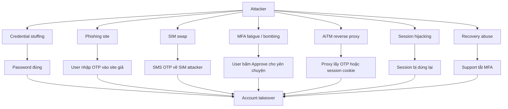
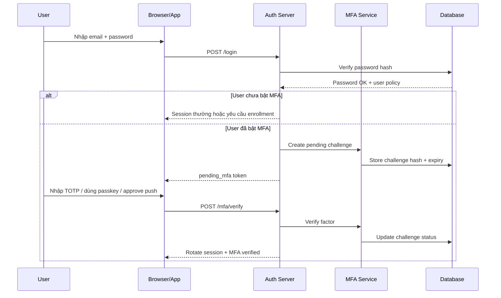
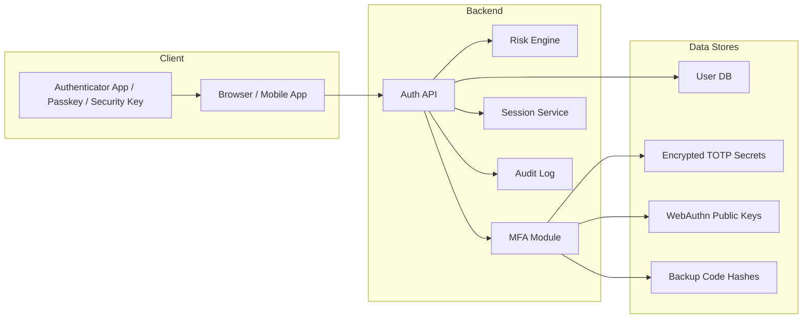
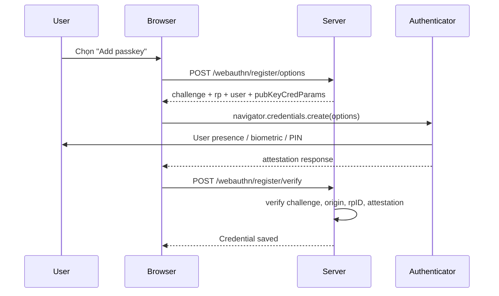

+++
date = 2026-06-05
draft = false
title = "MFA A→Z: Hướng Dẫn Bảo Mật Xác Thực Đa Yếu Tố Cho Developer"
summary = "MFA là gì, các loại factor, SMS/TOTP/Push/WebAuthn/Hardware key, attack vectors, và code example để dev implement ngay."
tags = ['MFA', 'Security', 'Authentication', 'Backend', 'WebAuthn']
categories = ['Security', 'Backend']
+++


MFA nghe như một checkbox trong trang admin: bật lên, user nhập thêm 6 số, xong. Đời mà dễ vậy thì security engineer đã có nhiều thời gian đi uống cà phê hơn rồi 😄

Thực tế, **Multi-Factor Authentication** là một lớp phòng thủ cực kỳ quan trọng, nhưng cũng là nơi dễ bị thiết kế nửa vời: SMS làm factor chính cho admin, push notification không có number matching, recovery flow chỉ cần email là tắt MFA, TOTP secret lưu plaintext, hoặc WebAuthn verify thiếu `origin`.

Bài này đi từ A tới Z, nói bằng tiếng Việt, đủ thân thiện để đọc lúc đang chờ CI chạy, nhưng vẫn đủ sâu để developer implement hoặc review một hệ thống auth thật.

> **TL;DR:** MFA không phải "nhập thêm một mã". MFA là yêu cầu user chứng minh thêm một yếu tố độc lập: thứ họ biết, thứ họ có, hoặc thứ thuộc về họ. Password có thể lộ, OTP có thể bị phish, push có thể bị spam, session có thể bị chôm. Thiết kế tốt mới là thứ cứu mình.

---

## 1️⃣ MFA là gì? Tại sao cần?

**MFA** là viết tắt của **Multi-Factor Authentication**, tức xác thực đa yếu tố. Khi user đăng nhập, hệ thống không chỉ hỏi:

```text
Bạn biết gì? -> password
```

mà còn hỏi thêm:

```text
Bạn đang giữ gì? -> điện thoại, authenticator app, passkey, hardware key
Bạn là ai?       -> vân tay, Face ID, Touch ID
```

Nếu password là chìa khóa cửa chính, MFA là thêm một lớp kiểm tra: "người đang cầm chìa này có đúng là chủ nhà không?". Không phải bất khả xâm phạm, nhưng attacker sẽ phải làm nhiều việc hơn đáng kể.

### Password thôi chưa đủ

Password là secret tĩnh. Nó có thể bị:

- Leak từ data breach.
- Reuse ở nhiều website.
- Bị đoán bằng credential stuffing.
- Bị lấy qua phishing.
- Bị đánh cắp bởi malware/infostealer.
- Bị paste nhầm vào Slack, ticket, log, hoặc một file tên `final_password_REAL.txt`. Đừng cười, chuyện này xảy ra thật 😅

MFA giảm blast radius của password. Nếu attacker có password nhưng không có factor thứ hai, login sẽ bị chặn hoặc ít nhất bị đưa vào luồng kiểm tra rủi ro cao hơn.

### Ví dụ thực tế: Twilio, Cloudflare, Snowflake

Năm 2022, Twilio công bố một vụ social engineering/smishing nhắm vào nhân viên để lấy credential. Cùng thời điểm, Cloudflare cũng bị nhắm bằng chiến dịch phishing tương tự, nhưng Cloudflare cho biết hệ thống không bị compromise vì nhân viên dùng physical security key FIDO2 cho truy cập ứng dụng nội bộ.

Điểm đáng nhớ: attacker không cần exploit kernel 0-day gì hoành tráng. Họ gửi SMS nhìn giống nội bộ, dụ user đăng nhập vào trang giả, rồi relay credential. Đời thường tới mức hơi khó chịu.

Với Snowflake, mốc chính là **2024**, không phải 2022. Mandiant/Google Cloud mô tả chiến dịch UNC5537 dùng credential từng bị đánh cắp qua infostealer để truy cập nhiều Snowflake customer instance. Một nguyên nhân lặp lại là nhiều account không bật MFA, nên username + password vẫn đủ để đi vào.

> **Caveat:** MFA không làm password trở nên vô nghĩa. Password yếu + MFA yếu vẫn là tổ hợp yếu. MFA tốt nhất khi đi cùng password policy hợp lý, rate limit, session hygiene, audit log và recovery flow tử tế.

---

## 2️⃣ 3 loại factor: Knowledge / Possession / Inherence

Một "factor" phải là bằng chứng độc lập. Nếu hai bước đều phụ thuộc vào cùng một inbox email đã bị chiếm, thì trông giống 2 bước nhưng không mạnh như bạn nghĩ.

| Factor | Câu hỏi | Ví dụ | Ghi chú cho dev |
|---|---|---|---|
| **Knowledge** | User biết gì? | Password, PIN, recovery phrase | Dễ triển khai, dễ bị leak/phish/reuse |
| **Possession** | User sở hữu gì? | Phone, TOTP app, passkey device, YubiKey | Mạnh nếu secret/private key không rời thiết bị |
| **Inherence** | User là ai? | Fingerprint, Face ID, Touch ID | Nên dùng local để unlock authenticator, đừng gửi biometric raw lên server |

Ngoài ba loại phổ biến này, tài liệu security đôi khi nhắc thêm context như vị trí, IP, device posture, hành vi gõ phím. Chúng hữu ích cho risk engine, nhưng thường không nên coi là factor chính để thay thế MFA.

### 2FA, MFA, 2SV khác nhau thế nào?

| Thuật ngữ | Ý nghĩa | Ví dụ |
|---|---|---|
| **2FA** | Two-Factor Authentication, đúng 2 factor | Password + TOTP |
| **MFA** | Multi-Factor Authentication, từ 2 factor trở lên | Password + WebAuthn + backup code |
| **2SV** | Two-Step Verification, 2 bước xác minh, chưa chắc độc lập | Password + email link |

Ví dụ password + email OTP có thể là 2 bước, nhưng nếu email đó cũng reset được password thì attacker chiếm email là có đường đi khá đẹp. Đừng trao chìa khóa nhà và chìa dự phòng cho cùng một người giao hàng.

---

## 3️⃣ Các phương pháp MFA phổ biến

### SMS OTP

SMS OTP là mã 6-8 số gửi qua tin nhắn.

Ưu điểm:

- User hiểu ngay, không cần cài app.
- Phù hợp onboarding đại chúng.
- Có thể dùng làm fallback tạm thời.

Nhược điểm:

- Dính **SIM swap**: attacker chuyển số phone của victim sang SIM của họ.
- Có thể bị malware đọc notification.
- Không chống phishing tốt: user nhập OTP vào site giả, attacker relay sang site thật.
- Phụ thuộc nhà mạng, có delay, có phí, có deliverability drama.

SMS tốt hơn không có MFA, nhưng không nên là factor chính cho admin, tài chính, production access hoặc tài khoản quyền cao.

### Email OTP / magic code

Email OTP là mã hoặc link gửi qua email.

Ưu điểm:

- Dễ implement.
- Không cần số điện thoại.
- Tốt cho verify email khi đăng ký.

Nhược điểm:

- Email thường là kênh reset password.
- Link có thể bị forward, preview bởi security scanner, hoặc bị phish.
- Nếu attacker đã vào được mailbox, email OTP không còn nhiều ý nghĩa.

Email OTP hợp lý cho low-risk step-up, verify email, hoặc recovery có kiểm soát. Với admin account thì hãy dùng TOTP/WebAuthn/hardware key.

### TOTP - Time-Based One-Time Password

TOTP là mã một lần dựa trên secret dùng chung và thời gian hiện tại:

```text
shared secret + time window -> 6 digits
```

Authenticator app như Google Authenticator, Microsoft Authenticator, 1Password, Bitwarden, Authy... giữ secret và sinh mã mới mỗi 30 giây.


Ưu điểm:

- Không phụ thuộc SMS/email.
- Hoạt động offline.
- Chi phí thấp.
- Chuẩn `otpauth://` phổ biến.

Nhược điểm:

- Server cần lưu secret để verify, nên phải encrypt.
- Vẫn bị phishing vì user có thể nhập mã vào site giả.
- User mất phone thì cần recovery.
- Clock drift có thể gây fail nếu server/user lệch giờ.

TOTP là lựa chọn "ngon-bổ-rẻ" cho nhiều SaaS, internal tool và app dev. Nhưng với threat model có phishing mạnh, hãy ưu tiên WebAuthn/passkey.

### Push notification

Push MFA gửi prompt tới app trên phone: "Có phải bạn đang login không?"


Ưu điểm:

- UX tốt hơn nhập mã.
- Có thể hiển thị context: app, browser, IP, location gần đúng.
- Có thể thêm number matching.

Nhược điểm:

- Dính **MFA fatigue/bombing** nếu attacker spam prompt.
- Cần mobile app hoặc vendor SDK.
- Nếu prompt chỉ có "Approve/Deny", user dễ bấm đại lúc đang họp.

Best practice cho push:

- Bắt buộc number matching.
- Rate limit số prompt.
- Hiển thị context rõ.
- Có nút "This was not me".
- Timeout challenge nhanh, không để pending cả ngày.

### WebAuthn / FIDO2 / Passkey

WebAuthn là API chuẩn của trình duyệt cho public-key authentication. FIDO2 là bộ chuẩn rộng hơn gồm WebAuthn và CTAP. Passkey là trải nghiệm đăng nhập dựa trên FIDO credential, thường được lưu hoặc đồng bộ bởi hệ điều hành/password manager.

Điểm khác biệt lớn: server **không lưu shared secret**. Server lưu **public key**. Private key nằm trong authenticator và không rời thiết bị.


Luồng ngắn gọn:

```text
Server tạo challenge
Browser gọi navigator.credentials.create() hoặc get()
Authenticator yêu cầu user presence/user verification
Authenticator ký challenge bằng private key
Server verify chữ ký bằng public key
```

Ưu điểm:

- Chống phishing rất tốt vì credential bị ràng buộc với origin/RP ID.
- Không có OTP để copy sang site giả.
- Private key không rời authenticator.
- UX tốt khi dùng passkey.

Nhược điểm:

- Implementation phức tạp hơn TOTP.
- Cần hiểu challenge, origin, RP ID, attestation/assertion.
- Recovery/account migration phải thiết kế kỹ.
- Enterprise có thể cần phân biệt synced passkey và hardware-bound key.

### Hardware key - ví dụ YubiKey

Hardware key là thiết bị vật lý qua USB/NFC/Bluetooth. YubiKey là ví dụ phổ biến.


Ưu điểm:

- Rất mạnh cho admin, SRE, production access.
- Private key nằm trên thiết bị.
- Chống phishing tốt khi dùng FIDO2/WebAuthn.
- User phải touch key, thể hiện user presence.

Nhược điểm:

- Tốn chi phí mua và phân phối.
- User có thể làm mất key.
- Cần backup key hoặc recovery flow.
- Mobile/desktop compatibility phải test kỹ.

Với account có quyền deploy, quản trị cloud, billing, production DB, nên yêu cầu ít nhất 2 hardware key hoặc 1 hardware key + passkey backup.

### Backup codes

Backup code là danh sách mã dùng một lần, cấp cho user sau khi bật MFA.

Ưu điểm:

- Cứu user khi mất phone/key.
- Không phụ thuộc SMS/email.
- Dễ triển khai.

Nhược điểm:

- User lưu vào screenshot, note app, hoặc gửi chính mình qua chat.
- Nếu server lưu plaintext, leak DB là mệt.
- Nếu code dùng lại được, nó không còn là backup "one-time".

Best practice:

- Sinh 8-12 code, mỗi code đủ entropy.
- Chỉ hiển thị plaintext một lần.
- Lưu hash, không lưu plaintext.
- Mark used ngay sau khi dùng.
- Regenerate thì vô hiệu hóa toàn bộ code cũ.

---

## 4️⃣ So sánh ưu/nhược điểm

| Phương pháp | UX | Chi phí | Chống phishing | Rủi ro chính | Nên dùng cho |
|---|---:|---:|---:|---|---|
| SMS OTP | Dễ | Trung bình | Yếu | SIM swap, delay, intercept | User phổ thông, fallback tạm |
| Email OTP | Dễ | Thấp | Yếu | Email takeover, link forwarding | Verify email, low-risk step-up |
| TOTP | Vừa | Thấp | Trung bình-yếu | Phishing, mất phone, secret leak | SaaS, internal tools, app dev |
| Push | Tốt | Trung bình/cao | Trung bình | MFA fatigue, prompt spam | App có mobile app |
| Push + number matching | Tốt | Trung bình/cao | Khá hơn push thường | User vẫn có thể bị social engineer | Workforce, enterprise |
| WebAuthn/passkey | Rất tốt | Thấp-trung bình | Mạnh | Recovery, device sync policy | Login hiện đại, high-risk users |
| Hardware key | Vừa | Cao | Rất mạnh | Mất key, logistics | Admin, production, finance |
| Backup codes | Kém nếu dùng thường xuyên | Thấp | Yếu-trung bình | Lưu không an toàn | Recovery, break-glass |

Nếu xây một SaaS mới từ đầu, roadmap thực dụng là:

1. Hỗ trợ passkey/WebAuthn nếu team đủ bandwidth.
2. Hỗ trợ TOTP làm lựa chọn phổ thông.
3. Cấp backup codes và recovery flow rõ ràng.
4. SMS/email chỉ là fallback có policy, không phải "best factor".

---

## 5️⃣ Attack vectors cần biết



### SIM swap

Attacker lừa hoặc mua chuộc kênh support nhà mạng để chuyển số phone của user sang SIM của họ. Nếu app dùng SMS OTP, attacker nhận được mã.

Cách giảm rủi ro:

- Không dùng SMS cho admin/high-risk account.
- Cho user chuyển sang TOTP/WebAuthn.
- Khi đổi phone number, yêu cầu re-auth + factor hiện tại.
- Notify khi phone number thay đổi.
- Delay/cool-down trước khi phone mới dùng được cho recovery.

### Phishing

User vào site giả, nhập password và OTP. Attacker dùng OTP trong 30 giây để login site thật.

TOTP không chống phishing ở protocol level vì mã 6 số không biết nó đang được nhập vào domain nào. WebAuthn/passkey mạnh hơn vì credential gắn với RP ID/origin.

Cách giảm:

- Ưu tiên WebAuthn/passkey cho account nhạy cảm.
- Step-up auth khi đổi email, đổi MFA, tạo API key, export data.
- Risk detection cho device/IP/location lạ.
- Training user, nhưng đừng đặt toàn bộ niềm tin vào training. User là con người, không phải firewall có cà phê.

### MFA fatigue / bombing

Attacker có password, sau đó spam push notification. User đang bận và bấm Approve cho hết phiền.

Cách giảm:

- Number matching.
- Rate limit prompt.
- Sau vài lần deny/timeout, khóa challenge.
- Prompt hiển thị context rõ.
- Có nút report suspicious.

### AiTM / MitM reverse proxy

AiTM là **Adversary-in-the-Middle**. Attacker dựng reverse proxy:

```text
User -> phishing domain -> real domain
```

Proxy relay password, OTP và thậm chí lấy session cookie sau login. Đây là lý do "có MFA" vẫn chưa đủ nếu factor là OTP có thể relay.

Cách giảm:

- WebAuthn/passkey cho phishing resistance.
- Cookie `HttpOnly`, `Secure`, `SameSite`.
- Re-auth cho thao tác nhạy cảm.
- Short-lived session cho admin panel.
- Detect impossible travel, ASN lạ, device lạ.

### Session hijacking

Nếu session cookie bị malware, XSS, reverse proxy hoặc log leak lấy được, attacker có thể bypass MFA vì họ không cần login nữa.

Cách giảm:

- XSS defense nghiêm túc.
- Cookie flags đầy đủ.
- Rotate session sau MFA success.
- Revoke all sessions khi reset MFA/password.
- Audit device/session list cho user.

---

## 6️⃣ Kiến trúc MFA flow

### Login flow với MFA



Điểm cần nhớ:

- Sau password đúng, chưa cấp full session. Chỉ cấp trạng thái tạm như `pending_mfa`.
- Challenge phải có expiry ngắn.
- Verify thành công thì rotate session id.
- Failure phải rate limit theo account, IP, device và challenge.
- Không log OTP, backup code, TOTP secret hoặc WebAuthn challenge raw theo cách dễ leak.

### Kiến trúc module MFA



`MFA Module` không bắt buộc là microservice. Trong monolith, nó có thể là package/module riêng. Điều cần tách là trách nhiệm:

- Auth API xử lý login state.
- MFA module verify factor.
- Session service cấp/rotate/revoke session.
- Audit log ghi sự kiện bảo mật.
- Secret vault hoặc encrypted column bảo vệ TOTP secret.
- WebAuthn credential store lưu public key, counter, transports, metadata.

---

## 7️⃣ Implement cho dev

### 7a. TOTP với Node.js

Cài package:

```bash
npm install otpauth qrcode
```

Ví dụ enrollment + verify:

```js
import { TOTP, Secret } from "otpauth";
import QRCode from "qrcode";

const issuer = "Jerry Notes";

export async function startTotpEnrollment(user) {
  // 1. Generate secret. Store encrypted while enrollment is pending.
  const secret = new Secret({ size: 20 });

  const totp = new TOTP({
    issuer,
    label: user.email,
    algorithm: "SHA1",
    digits: 6,
    period: 30,
    secret,
  });

  // 2. otpauth URL can be encoded as QR for authenticator apps.
  const otpauthUrl = totp.toString();
  const qrDataUrl = await QRCode.toDataURL(otpauthUrl);

  await db.mfaFactors.insert({
    userId: user.id,
    type: "totp",
    status: "pending",
    // Encrypt at application layer or via KMS/encrypted column.
    secretEncrypted: await encrypt(secret.base32),
    createdAt: new Date(),
  });

  return { otpauthUrl, qrDataUrl };
}

export async function confirmTotpEnrollment(userId, submittedToken) {
  const factor = await db.mfaFactors.findPendingTotp(userId);
  if (!factor) throw new Error("TOTP enrollment not found");

  const secretBase32 = await decrypt(factor.secretEncrypted);
  const totp = new TOTP({
    issuer,
    label: factor.userEmail,
    algorithm: "SHA1",
    digits: 6,
    period: 30,
    secret: Secret.fromBase32(secretBase32),
  });

  // window: 1 accepts previous/current/next 30s time step.
  // Return value is delta, null means invalid.
  const delta = totp.validate({ token: submittedToken, window: 1 });
  if (delta === null) {
    await rateLimit.bump(`totp-confirm:${userId}`);
    throw new Error("Invalid code");
  }

  await db.mfaFactors.activate(factor.id);
  await audit.log(userId, "mfa.totp.enabled");
}

export async function verifyTotpLogin(userId, submittedToken, challengeId) {
  await rateLimit.assertAllowed(`totp-login:${userId}`);

  const challenge = await db.mfaChallenges.findPending(challengeId, userId);
  if (!challenge || challenge.expiresAt < new Date()) {
    throw new Error("Challenge expired");
  }

  const factor = await db.mfaFactors.findActiveTotp(userId);
  const secretBase32 = await decrypt(factor.secretEncrypted);
  const totp = new TOTP({
    issuer,
    label: factor.userEmail,
    secret: Secret.fromBase32(secretBase32),
  });

  const delta = totp.validate({ token: submittedToken, window: 1 });
  if (delta === null) {
    await db.mfaChallenges.incrementAttempts(challengeId);
    await rateLimit.bump(`totp-login:${userId}`);
    throw new Error("Invalid code");
  }

  await db.mfaChallenges.markPassed(challengeId);
  await db.mfaFactors.markUsed(factor.id);
  await audit.log(userId, "mfa.totp.verified");
}
```

> **Tip:** Đừng set `mfa_enabled = true` ngay sau khi tạo QR. Chỉ activate factor sau khi user nhập đúng mã đầu tiên. Nếu không, user scan lỗi một cái là tự khóa mình luôn. Một kiểu tự DDoS bản thân khá buồn.

Model dữ liệu tối thiểu:

```text
mfa_factors
  id
  user_id
  type: totp | webauthn | sms | email | backup_code
  name
  status: pending | active | disabled
  secret_encrypted
  created_at
  last_used_at

mfa_challenges
  id
  user_id
  type
  status: pending | passed | failed | expired
  expires_at
  attempt_count
```

### 7b. WebAuthn API cơ bản với `@simplewebauthn/server`

Cài package:

```bash
npm install @simplewebauthn/server
```

WebAuthn có hai flow chính:

- **Registration**: tạo credential mới, server lưu public key.
- **Authentication/assertion**: authenticator ký challenge, server verify bằng public key.

#### WebAuthn registration



Server-side example:

```js
import {
  generateRegistrationOptions,
  verifyRegistrationResponse,
  generateAuthenticationOptions,
  verifyAuthenticationResponse,
} from "@simplewebauthn/server";

const rpName = "Jerry Notes";
const rpID = "thangvd2312.github.io";
const origin = "https://thangvd2312.github.io";

export async function webauthnRegistrationOptions(user) {
  const existingCredentials = await db.webauthnCredentials.findByUserId(user.id);

  const options = await generateRegistrationOptions({
    rpName,
    rpID,
    userID: user.id,
    userName: user.email,
    attestationType: "none",
    excludeCredentials: existingCredentials.map((credential) => ({
      id: credential.credentialID,
      type: "public-key",
      transports: credential.transports,
    })),
    authenticatorSelection: {
      residentKey: "preferred",
      userVerification: "preferred",
    },
  });

  await db.webAuthnChallenges.save({
    userId: user.id,
    challenge: options.challenge,
    type: "registration",
    expiresAt: new Date(Date.now() + 5 * 60 * 1000),
  });

  return options;
}

export async function verifyWebauthnRegistration(user, body) {
  const expectedChallenge = await db.webAuthnChallenges.consume(
    user.id,
    "registration",
  );

  const verification = await verifyRegistrationResponse({
    response: body,
    expectedChallenge,
    expectedOrigin: origin,
    expectedRPID: rpID,
    requireUserVerification: false,
  });

  if (!verification.verified || !verification.registrationInfo) {
    throw new Error("Invalid WebAuthn registration");
  }

  const { credential, credentialDeviceType, credentialBackedUp } =
    verification.registrationInfo;

  await db.webauthnCredentials.insert({
    userId: user.id,
    credentialID: credential.id,
    publicKey: credential.publicKey,
    counter: credential.counter,
    transports: body.response?.transports ?? [],
    deviceType: credentialDeviceType,
    backedUp: credentialBackedUp,
    createdAt: new Date(),
  });

  await audit.log(user.id, "mfa.webauthn.registered");
}
```

#### WebAuthn authentication/assertion

```js
export async function webauthnAuthenticationOptions(user) {
  const credentials = await db.webauthnCredentials.findByUserId(user.id);

  const options = await generateAuthenticationOptions({
    rpID,
    allowCredentials: credentials.map((credential) => ({
      id: credential.credentialID,
      type: "public-key",
      transports: credential.transports,
    })),
    userVerification: "preferred",
  });

  await db.webAuthnChallenges.save({
    userId: user.id,
    challenge: options.challenge,
    type: "authentication",
    expiresAt: new Date(Date.now() + 5 * 60 * 1000),
  });

  return options;
}

export async function verifyWebauthnAuthentication(user, body) {
  const expectedChallenge = await db.webAuthnChallenges.consume(
    user.id,
    "authentication",
  );

  const credential = await db.webauthnCredentials.findByCredentialId(body.id);
  if (!credential || credential.userId !== user.id) {
    throw new Error("Credential not found");
  }

  const verification = await verifyAuthenticationResponse({
    response: body,
    expectedChallenge,
    expectedOrigin: origin,
    expectedRPID: rpID,
    credential: {
      id: credential.credentialID,
      publicKey: credential.publicKey,
      counter: credential.counter,
      transports: credential.transports,
    },
    requireUserVerification: false,
  });

  if (!verification.verified) {
    throw new Error("Invalid WebAuthn assertion");
  }

  await db.webauthnCredentials.updateCounter(
    credential.id,
    verification.authenticationInfo.newCounter,
  );
  await db.webauthnCredentials.markUsed(credential.id);
  await audit.log(user.id, "mfa.webauthn.verified");
}
```

Checklist verify WebAuthn:

- `expectedChallenge` phải lấy từ server-side store, dùng một lần.
- `expectedOrigin` phải đúng scheme + domain production.
- `expectedRPID` phải đúng domain scope.
- Credential ID phải thuộc về user đang login.
- Counter nên được cập nhật để phát hiện clone trong một số loại authenticator.
- Đừng tự parse attestation/assertion nếu chưa cần. Dùng library đã battle-tested.

---

## 8️⃣ Recovery flow & account lockout

Recovery flow là cửa sau của MFA. Nếu cửa trước có WebAuthn xịn nhưng support có thể tắt MFA chỉ bằng câu "em là CEO đây, đang gấp", thì hệ thống vẫn yếu.

### Backup codes

Backup codes nên được cấp ngay sau khi user bật MFA:

- Hiển thị một lần.
- Có nút download/copy.
- Khuyến khích lưu trong password manager.
- Lưu server-side dưới dạng hash.
- Mỗi code dùng đúng một lần.
- Khi regenerate, revoke toàn bộ code cũ.

Pseudo-flow:

```text
User nhập password
User chọn "Use backup code"
Server verify code hash
Server mark code used
Server rotate session
Server notify user: backup code was used
```

### Support verification

Support flow nên có policy theo risk:

| Loại account | Có thể reset qua support? | Yêu cầu |
|---|---:|---|
| User thường | Có, nhưng có kiểm soát | Verify email, recent billing, delay, notify |
| Business admin | Hạn chế | Approval từ owner khác, audit log |
| Internal admin/SRE | Rất hạn chế | Identity proofing mạnh, manager approval, security review |
| Break-glass account | Theo runbook riêng | Offline secret, dual control, post-incident review |

Đừng cho support đọc hoặc xem TOTP secret. Support chỉ nên có action như `reset_mfa_requested`, `reset_mfa_approved`, `reset_mfa_completed`, tất cả đều audit.

### Rate limit và lockout

MFA verify cần rate limit, nhưng lockout quá tay cũng thành DoS. Attacker có thể spam sai OTP để khóa account của người khác.

Gợi ý:

- Rate limit theo `user_id + factor_type`.
- Rate limit theo IP/device fingerprint.
- Exponential backoff cho challenge.
- Expire challenge sau 5-10 phút.
- Sau nhiều lần sai, yêu cầu password lại.
- Với account quyền cao, alert security team.

> **Caveat:** "Khóa account sau 3 lần OTP sai" nghe an toàn nhưng có thể bị dùng để phá user. Hãy ưu tiên lock challenge, delay, step-up và alert thay vì khóa cứng account ngay lập tức.

### Khi reset MFA

Khi factor bị remove/reset:

- Revoke session hiện tại và session cũ.
- Revoke refresh token.
- Revoke hoặc rotate API key nếu policy yêu cầu.
- Notify qua email và in-app.
- Ghi audit log.
- Có cool-down trước khi cho đổi email/phone/password tiếp.

---

## 9️⃣ Checklist triển khai

### Product & policy

- [ ] Xác định account nào bắt buộc MFA: admin, billing, API key owner, production access.
- [ ] Cho user có ít nhất 2 factor active nếu account high-risk.
- [ ] Có recovery flow rõ ràng trước khi bắt buộc MFA.
- [ ] Có thông báo khi bật/tắt/thêm/xóa factor.
- [ ] Có session/device management cho user.

### TOTP

- [ ] Secret sinh bằng CSPRNG, đủ entropy.
- [ ] Secret lưu encrypted, không plaintext.
- [ ] Enrollment chỉ active sau khi verify mã đầu tiên.
- [ ] Verify có time window nhỏ, thường `±1` step.
- [ ] Rate limit confirm và login.
- [ ] Không log OTP hoặc secret.

### Push

- [ ] Có number matching.
- [ ] Prompt hiển thị context rõ.
- [ ] Rate limit số push.
- [ ] Có "This was not me".
- [ ] Deny/timeout nhiều lần thì khóa challenge.

### WebAuthn/passkey

- [ ] Verify challenge server-side, single-use.
- [ ] Verify `origin` và `rpID`.
- [ ] Credential ID phải thuộc user.
- [ ] Lưu public key, counter, transports, backup/device type metadata.
- [ ] Hỗ trợ nhiều credential mỗi user.
- [ ] Có recovery/backup credential.

### Session & audit

- [ ] Pending MFA không phải full session.
- [ ] Rotate session sau MFA pass.
- [ ] Re-auth cho action nhạy cảm.
- [ ] Revoke session khi reset password/MFA.
- [ ] Audit log các event MFA.
- [ ] Alert cho high-risk event.

### Recovery

- [ ] Backup codes đủ entropy, hash server-side.
- [ ] Backup code dùng một lần.
- [ ] Support không được xem secret.
- [ ] High-risk reset cần approval/cool-down.
- [ ] Reset MFA thì revoke sessions/tokens.

---

## 🔟 Phụ lục

### Glossary

| Thuật ngữ | Nghĩa ngắn |
|---|---|
| **MFA** | Multi-Factor Authentication, xác thực đa yếu tố |
| **2FA** | Two-Factor Authentication, xác thực hai yếu tố |
| **TOTP** | Time-Based One-Time Password, mã OTP dựa trên thời gian |
| **HOTP** | HMAC-Based One-Time Password, mã OTP dựa trên counter |
| **WebAuthn** | Web API cho public-key authentication |
| **FIDO2** | Bộ chuẩn gồm WebAuthn + CTAP |
| **Passkey** | Credential FIDO thân thiện với user, thường sync được |
| **RP ID** | Relying Party ID, domain scope của WebAuthn credential |
| **Attestation** | Dữ liệu khi đăng ký credential mới |
| **Assertion** | Dữ liệu khi authenticator ký challenge để login |
| **User presence** | User có mặt, ví dụ chạm vào security key |
| **User verification** | Xác minh local như PIN/biometric |
| **AiTM** | Adversary-in-the-Middle, reverse proxy phishing |
| **SIM swap** | Chiếm số điện thoại qua nhà mạng |
| **MFA fatigue** | Spam push MFA để user bấm approve |

### References

- OWASP Multifactor Authentication Cheat Sheet: https://cheatsheetseries.owasp.org/cheatsheets/Multifactor_Authentication_Cheat_Sheet.html
- OWASP Authentication Cheat Sheet: https://cheatsheetseries.owasp.org/cheatsheets/Authentication_Cheat_Sheet.html
- NIST SP 800-63B Digital Identity Guidelines: https://pages.nist.gov/800-63-4/sp800-63b.html
- W3C Web Authentication: https://www.w3.org/TR/webauthn-3/
- FIDO Alliance - Passkeys: https://fidoalliance.org/passkeys/
- FIDO Alliance - FIDO2: https://fidoalliance.org/fido2/
- SimpleWebAuthn docs: https://simplewebauthn.dev/
- Twilio incident report, August 2022: https://www.twilio.com/en-us/blog/archive/2022/august-2022-social-engineering-attack
- Cloudflare phishing write-up, August 2022: https://blog.cloudflare.com/2022-07-sms-phishing-attacks/
- Google Cloud/Mandiant UNC5537 Snowflake campaign, June 2024: https://cloud.google.com/blog/topics/threat-intelligence/unc5537-snowflake-data-theft-extortion

### Chốt lại

MFA không phải một tính năng lẻ. Nó là một phần của hệ sinh thái auth gồm password, session, recovery, audit, risk detection và support process.

Nếu cần chọn nhanh:

- User phổ thông: TOTP + backup codes, thêm passkey nếu được.
- Admin/high-risk: WebAuthn/passkey hoặc hardware key, có ít nhất 2 credential.
- SMS/email: fallback có kiểm soát, không phải chuẩn vàng.
- Recovery: thiết kế kỹ như login, vì attacker rất thích đi cửa sau.

MFA tốt là thứ user dùng được hằng ngày, dev vận hành được lâu dài, và attacker nhìn vào thấy "thôi kiếm target khác cho đỡ mệt" 😄
